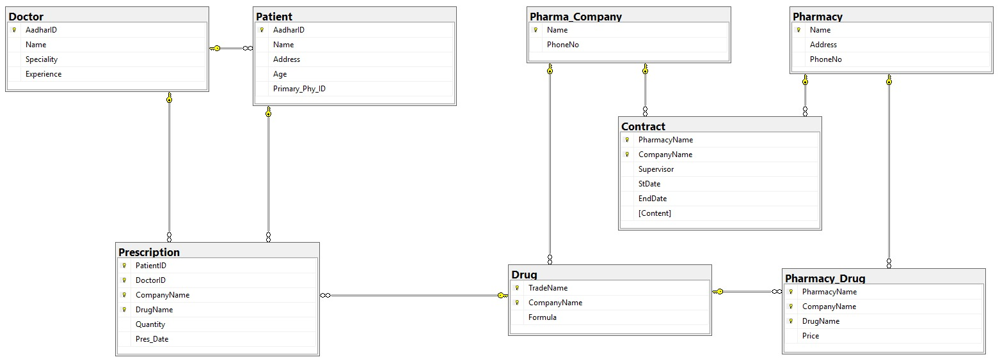

# Pharmacy Database System Design

This repository contains the design and implementation of a relational database for **NOVA**, a chain of pharmacies. It models the interactions between doctors, patients, drugs, pharmaceutical companies, and pharmacy branches.

## Purpose

This project simulates how a real-world pharmacy ecosystem functions by storing, manipulating, and retrieving medical and pharmaceutical data using SQL.

It enables:

- Prescription tracking  
- Drug inventory management  
- Contract management  
- Patient and doctor records  
- Pharmaceutical supplier relationships  

## Components

### Tables

The following entities are represented as relational tables:

- **Doctor**: Aadhar ID, name, specialty, experience  
- **Patient**: Aadhar ID, name, address, age, primary physician  
- **Pharma_Company**: Company name and phone number  
- **Pharmacy**: Pharmacy name, address, phone number  
- **Drug**: Trade name, company name, formula  
- **Prescription**: Records prescriptions issued  
- **Pharmacy_Drug**: Drug availability and price at each pharmacy  
- **Contract**: Contracts between pharma companies and pharmacies  

### Stored Procedures

Custom **PL/SQL procedures** have been implemented for all core operations.

#### Insert Operations

- `addDoctor`  
- `addPatient`  
- `addPharmacy`  
- `addCompany`  
- `addDrug`  
- `addPrescription` (deletes any existing prescription between the same patient and doctor before inserting)  
- `addContract`  

#### Delete Operations

- `delete_doctor`  
- `delete_patient`  
- `delete_pharmacy`  
- `delete_pharma_company`  
- `delete_drug`  
- `delete_prescription`  
- `delete_pharmacy_drug`  
- `delete_contract`  

#### Update Operations

- `update_doctor_exp`  
- `update_patient_address`  
- `update_patient_primary_phy`  
- `update_pharma_phone`  
- `update_pharmacy_phone`  
- `update_drug_formula`  

#### Report / Query Procedures

- `report`: Generates a prescription history report for a patient between two dates  
- `get_prescriptions_by_patient_and_date`: Shows prescriptions of a patient on a particular date  
- `drug_details`: Lists all drugs produced by a pharma company  
- `stock_position`: Displays all drugs and prices available at a pharmacy  
- `contract_details`: Displays full contract information between a pharmacy and a company  
- `Doctor_List`: Lists all patients under a specific doctor  

## Tech Stack

- **Oracle SQL** with **PL/SQL Procedures**  
- Oracle Database 21c / XE  
- SQL Developer / SQL*Plus  
